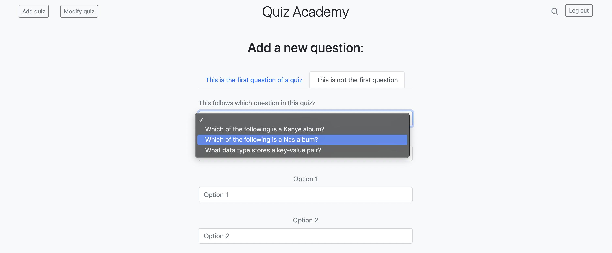
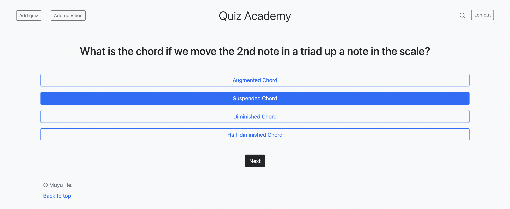

# Quiz Academy
An interactive quiz app to take quizzes and track scores.
## Features
- Select from a database of quizzes to take a quiz.

    

- Add new question to any quiz the user selects, and insert it after any existing question according to the user's choice.

    

- Go through multiple pages to answer multiple-choice questions, while the scores are tracked.

    

- See the score, correct answers, wrong answers, and percentage directly after answering the last question.

    

## Installment
To begin with, clone the project.
```
git clone https://github.com/RiddleHe/quiz_academy
```
After that, in the main directory, set up and activate a virtual environment to harbor the dependencies.
```
python3 -m venv ll_env
source ll_env/bin/activate
```
When the virtual environment is set up, install the dependencies.
```
pip install Django
pip install django-bootstrap-v5
```
Then, in the main directory, run the server to load the web application, and now you can interact with it.
```
quiz % python3 manage.py runserver
```
## Technologies
*Using Python, Django, HTML, and Bootstrap*
- Used a doubly linked list to structure the questions, so users can answer one question after another and see scores that belong particularly to this user and this quiz.
- Took advantage of the doubly linked list structure to easily add new questions to any location with a given quiz.
- Used Django to configure the URLs of each question page, so users would always be directed to the correct next question when they finished the last.
- Worked with POST request data to calculate the scores.
- Applied conditionals in HTML files so that given the user's number of quizzes taken, type of quiz they are taking, etc., they can see different collection of score reports, questions, and result in the same HTML page.
